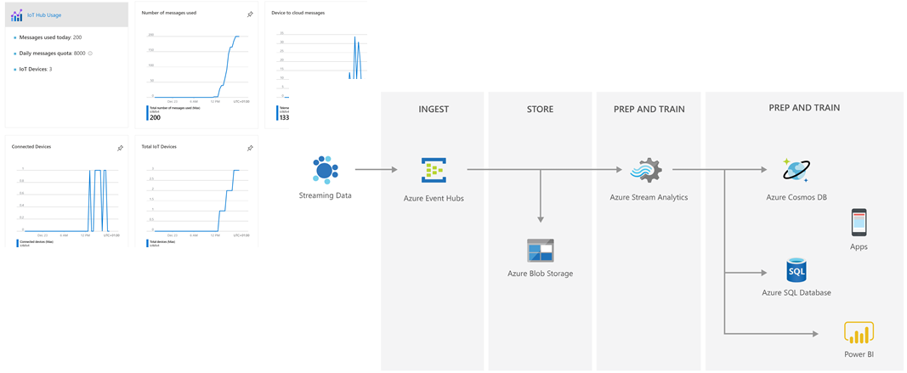

Cloud IoT Services
==================

Cloud Anbindung an Amazon (AWS), Google und Microsoft (Azure)

## Azure IoT
***

Quelle: https://docs.microsoft.com/de-de/azure/iot-hub/about-iot-hub
- - - 

IoT Hub ist ein in der Cloud gehosteter, verwalteter Dienst, der als zentraler Nachrichtenhub für die bidirektionale Kommunikation zwischen Ihrer IoT-Anwendung und den Geräten dient, die von der Anwendung verwaltet werden. Sie können Azure IoT Hub verwenden, um IoT-Lösungen mit zuverlässiger und sicherer Kommunikation zwischen Millionen von IoT-Geräten und einem in der Cloud gehosteten Lösungs-Back-End zu erstellen. Sie können praktisch jedes Gerät mit IoT Hub verbinden.

IoT Hub unterstützt die Kommunikation sowohl vom Gerät an die Cloud als auch von der Cloud an das Gerät. IoT Hub unterstützt mehrere Messagingmuster wie z.B. Gerät-zu-Cloud-Telemetrie, Dateiuploads von Geräten und Anforderungs-Antwort-Methoden zum Steuern der Geräte über die Cloud. Die IoT Hub-Überwachung unterstützt Sie dabei, die Integrität Ihrer Lösung sicherzustellen, indem Ereignisse wie Geräteerstellung, Geräteausfälle und Geräteverbindungen nachverfolgt werden.

Azure IoT Hub unterstützt folgende Protokolle:
* HTTPS
* AMQP
* AMQP über WebSockets
* MQTT
* MQTT über WebSockets

Das mbed Beispiel verbindet sich via dem MQTT Protokoll mit der Azure Cloud.

* [Mbed OS example for Azure IoT Hub](https://github.com/ARMmbed/mbed-os-example-for-azure)

## AWS IoT
***

Quelle: https://docs.aws.amazon.com/iot/latest/developerguide/what-is-aws-iot.html
- - -

Mit AWS IoT können Sie die am besten geeigneten und aktuellsten Technologien für Ihre Lösung auswählen. AWS IoT Core unterstützt die folgenden Protokolle, damit Sie Ihre IoT-Geräte vor Ort verwalten und unterstützen können:

* [MQTT](https://docs.aws.amazon.com/iot/latest/developerguide/mqtt.html) (Message Queuing und Telemetrietransport)
* [MQTT](https://docs.aws.amazon.com/iot/latest/developerguide/mqtt.html) über WSS (Websockets Secure)
* [HTTPS](https://docs.aws.amazon.com/iot/latest/developerguide/http.html) (Hypertext Transfer Protocol - Sicher) .
* [LoRaWAN](https://docs.aws.amazon.com/iot/latest/developerguide/connect-iot-lorawan.html) (Long Range Wide Area Network)

Der AWS IoT Core-Nachrichtenbroker unterstützt Geräte und Clients, die MQTT und MQTT über WSS-Protokolle zum Veröffentlichen und Abonnieren von Nachrichten verwenden. Es werden auch Geräte und Clients unterstützt, die das HTTPS-Protokoll zum Veröffentlichen von Nachrichten verwenden.

Mit AWS IoT Core für LoRaWAN können Sie drahtlose LoRaWAN-Geräte (Low-Power-Wide Area Network mit großer Reichweite) verbinden und verwalten. AWS IoT Core für LoRaWAN ersetzt die Notwendigkeit, einen LoRaWAN Network Server (LNS) zu entwickeln und zu betreiben.

Das mbed Beispiel verbindet sich via dem MQTT Protokoll mit der AWS Cloud.

* [Mbed OS example for AWS IoT SDK](https://github.com/ARMmbed/mbed-os-example-for-aws)

